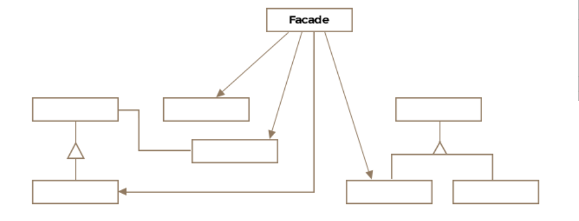

# Table of contents
- [Table of contents](#table-of-contents)
- [Facade Pattern](#facade-pattern)
- [Class Diagram](#class-diagram)


# Facade Pattern 
A facade literally means the front of a building or an outward appearance to hide a less pleasant reality. The facade pattern essentially doeas the same job as the definition of the word facade. Its purpose is to hide the complexity of an interface or a subsystem. 

Formally the facade pattern is defined as a single uber interface to one or more subsystems or interfaces intending to make use of the subsystemcs easier. 


# Class Diagram 


Basically the facade provides a simple interface to the complex subsystem. And the subsystem classes are the classes that contain the actual complex logic. The facade interacts with these classes to perform the required operations.


# Use Cases 
- Simplifying Complex Libraries: When we have a complex library with many classes and methods, a facade can provide a simpler interface to interact with the library. 
- Decoupling Code: It helps in decoupling the client code from the subsystem, making the code easier to maintain and test. 
- Improving Readability: By hiding the complexities, it makes the code more readable and easier to understand


# Example with Django 
Let's consider a scenario where we have a complex process for user registration that involves multiple steps like creating a user, sending a welcome email, and logging the registration event. The facade simplify this process. 

## First we define the subsystem classes which are the user creation, the email sending and logging 
```python 
# subsystems.py 

from django.contrib.auth.models import User
from django.core.mail import send_mail 
import logging


class UserService: 
    def create_user(self, username, email, password):
        user = User.objects.create_user(username=username, email=email, password=password)
        return user 


class EmailService: 
    def send_welcome_mail(self, email):
        send_mail(
            "Welcome!", 
            "Thank you for registering. ",
            "user@example.com",
            [email],
            fail_silently=False,
        )


class LoggingService:
    def log_event(self, message):
        logger = logging.getLogger(__name__)
        logger.info(message)
```

## Then we have to define the Facade Class 
```python 
# facade.py 
from .subsystems import UserService, EmailService, LoggingService


class UserRegistrationFacade: 
    def __init__(self):
        self.user_service = UserService()
        self.email_service = EmailService()
        self.logging_service = LoggingService()

    def register_user(self, username, email, password):
        user = self.user_service.create_user(username, email. password)
        self.email_service.send_welcome_mail(email)
        self.logging_service.log_event(f"User {username} registered successfully.")
        return user
```

## Once we have our facade class we have to implement it in views.py
```python 
from django.http import HttpResponse 
from .facade import UserRegistrationFacade

def register(request):
    if request.method == "POST":
        username = request.POST['username']
        email = request.POST['email']
        password = request.POST['password']

        facade = UserRegistrationFacade()
        user = facade.register_user(username, email, password)

        return HttpResponse(f"User {user.username} registered successfully")
    return render(request, "register.html")