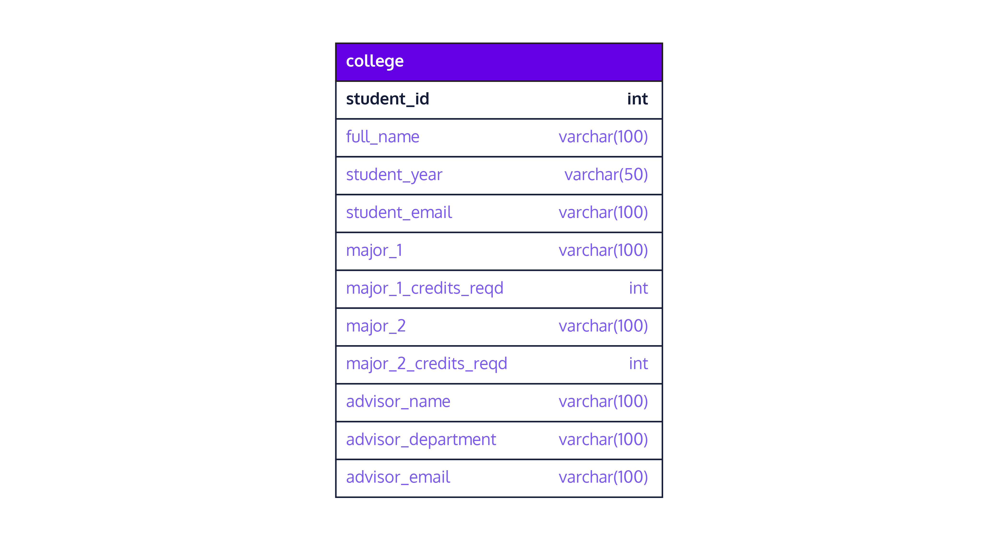

# Table of contents
- [Table of contents](#table-of-contents)

# Normalization
## What is normalization? 
Normalization is the process of restructuring a database. 


## Duplicated Data
We can have multiple students with the same teacher, and if we try to query only the data of the teacher that is inside the same table as the students, the data will be repeated multiple times. 


### Data Update Challenges
- Updating information when it's repeated can be problematic 
    
### Data Insertion Challenges
- There must be a primary key row in order to insert data
- If we try to fake an ID it will cause errors on the information
    
### Search and Sort Efficiency
- We have to be consistent with the information stored in a table, avoiding inconsistencies when counting or making calculations. For example, having to different rows for two different majors, where we are counting only the first major of the students, but the second is ignored.
    
    
## Create Tables From an Existing One

```sql
CREATE TABLE tablename AS query
```

Once we have moved all the query into the new table, we can drop the columns from the original table. For example: 

```sql
CREATE TABLE majors AS
SELECT distinct major_1, major_1_credits_reqd
FROM college;
```

Now the columns selected can be deleted from the original one. 

## Non-Normalized vs Normalized
### Non-normalized



### Normalized 
