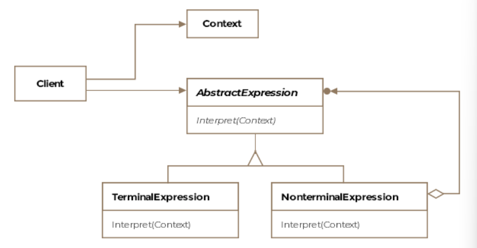

# Table of contents 
- [Table of contents](#table-of-contents)
- [Interpreter Pattern](#interpreter-pattern)
  - [How it works](#how-it-works)
- [Grammar](#grammar)
  - [Context Free Grammar](#context-free-grammar)
- [Class Diagram](#class-diagram)
- [Use Cases](#use-cases)

# Interpreter Pattern 
The interpreter literally means a translator, someone who can convert from one form of speech to another. The interpreter pattern requires background knowledge in automata and theory of computation. We'll briefly go over some of the concepts required to understand the pattern.

Formally, the pattern is defined as **describe a way to represent the grammar of a language along with an interpreter that uses the representation to interpret sentences in the language.**

## How it works 
1. Abstract Expression: An interface that declares an interpret method 
2. Terminal Expression: Implements the interpret method for terminal symbols in the grammar. 
3. Non-terminal expression: Implements the interpret method for non-terminal symbols in the grammar. 
4. Context: Contains information that is global to the interpreter. 

# Grammar 
There are four types of grammar known as the Chomsky's hierarchy. 

- Regular
- Context Free 
- Context Sensitive 
- Recursively Enumerable 

## Context Free Grammar
A CFG consists of four components: 

- start symbol 
- a set of terminal symbols 
- a set of non-terminal symbols 
- a set of productions (rules)

We can create an expression using the CFG 
- <expression> using the start symbol 
- <expression> + <expression> using the second production rule 
- 7 + <expression> * <expression> using the first and fourth production rules 
- 7 + 4 * 3 using the production rule 

The string 7 + 4 * 3 is said to be in the language of the grammar that we defined. 

# Class Diagram 

# Use Cases 
1. Parsing Expressions: Evaluating mathematical expression, boolean expression, or any type of expressions. 
2. Configuration Languages: Interpreting configuration files or scripts. 
3. Command Languages: Implementing command interpreters for scripting languages. 
4. Compilers and interpreters: Parsing and interpreting programming languages. 

