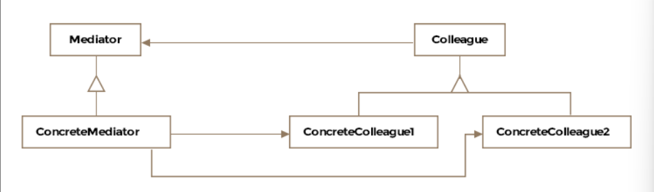

# Table of contents 
- [Table of contents](#table-of-contents)
- [Meditator Pattern](#meditator-pattern)
  - [How it works](#how-it-works)
- [Use cases](#use-cases)
- [Class Diagram](#class-diagram)
- [Example in a Django Project](#example-in-a-django-project)
  - [Define the mediator interface](#define-the-mediator-interface)
  - [Define the concrete mediator](#define-the-concrete-mediator)
  - [Define the Colleague Interface](#define-the-colleague-interface)
  - [Define the Concrete colleague](#define-the-concrete-colleague)
  - [Usage Example](#usage-example)
- [views.py](#viewspy)

# Meditator Pattern
The pattern definition says it is applied to encapsulate or centralize the interactions amongst a number of objects. Object orientated design may result in behavior being distributed among several classes and lead to too many connections among objects. 

Formally, the pattern is defined as **encouraging loose coupling among interacting objects by encapsulating their interactions in a mediator object, thus avoiding the need for individual objects to refer to each other directly and allowing to vary object interactions independently**. 

This pattern should be applied when there are many objects communicating in a well-structured but complex manner resulting in interdependencies that are hard to understand. 

## How it works
1. Mediator Interface: Defines an interface for communicating with colleague objects.
2. Concrete Mediator: Implements the mediator interface and coordinates communication between colleague objects. 
3. Colleague Interface: Defines an interface for colleague objects. 
4. Concrete Colleague: Implements the collegue interface and communicates with other colleagues through the mediator. 

# Use cases 
1. **GUI Components**: Managing interactions between GUI components like buttons, text fields, and dialogs. 
2. **Chat Applications**: Managing communication between multiple chat participants. 
3. **Workflow Systems**: Coordinating tasks and activities in a workflow. 
4. **Air Traffic Control**: Managing communication between multiple aircraft. 

# Class Diagram 


# Example in a Django Project
Let's consider a scenario where we have a chat application, and we want to manage communication between multiple users through a mediator. 

## Define the mediator interface
Create an interface that declares the methods for communicating with colleague objects. 

```python 
# mediator.py 
from abc import ABC, abstractmethod


class Mediator(ABC):
    @abstractmethod 
    def send_message(self, message, colleague):
        pass 
```


## Define the concrete mediator
Implement the concrete mediator that coordinates communication between colleague objects. 

```python 
# concrete_mediator.py
from .mediator import Mediator 


class ChatMediator(Mediator):
    def __init__(self):
        self._colleagues = []

    def add_colleague(self, colleague):
        self._colleages.append(colleague)

    def send_message(self, message, colleague):
        for c in self._colleagues:
            if c != colleague:
                c.receive_message(message)
```

## Define the Colleague Interface 
Create an interface that declares the methods for colleague objects. 

```python 
# colleague.py 
from abc import ABC, abstractmethod 


class Colleague(ABC):
    def __init__(self, mediator):
        self._mediator = mediator

    @abstractmethod
    def send_message(self, message):
        pass 

    @abstractmethod
    def receive_message(self, message):
        pass
```


## Define the Concrete colleague 
Implement the concrete colleague that communicates with other colleagues through the mediator

```python 
# concrete_colleague.py 
from .colleague import Colleague 


class User(Colleague):
    def __init__(self, mediator, name):
        super().__init__(mediator)

    def send_message(self, message):
        print(f"{self._name} sends: {message}")
        self._mediator.send_message(message)

    def receive_message(self, message):
        print(f"{self._name} receives: {message}")
```


## Usage Example
Use the mediator pattern in a view to manage communication between users. 

```python 
# views.py 
from django.http import HttpResponse
from .concrete_mediator import ChatMediator
from .concrete_colleague import User

def chat_view(request):
    mediator = ChatMediator()

    # Create users and add them to the mediator
    user1 = User(mediator, "Alice")
    user2 = User(mediator, "John")
    user3 = User(mediator, "Mark")

    mediator.add_colleague(user1)
    mediator.add_colleague(user2)
    mediator.add_colleague(user3)

    # Users send messages
    user1.send_message("Hello, everyone!")
    user2.send_message("Hi, Alice!")
    user3.send_message("Hey, folks!")

    return HttpResponse("Messages sent and received.")