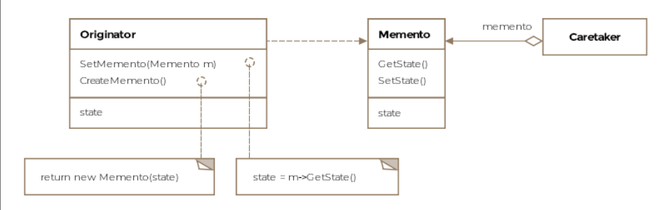

# Table of contents 
- [Table of contents](#table-of-contents)

# Memento Pattern 
The literal meaning of memento is an object kept as a reminder or souvenir of a person or an event. The memento pattern let's us capture the internal state of an object without exposing its internal structure so that the object can be resoted to this state later. In some sense we are saving a token or a memento at a later time. 

The object whose state we capture is called the **Originator**. The originator's snapshot is called the **memento**. The memento object is held by another object called the **Caretaker**. The interaction between these three entities happends as follows: 

1. The caretaker requests the originator for a snapshot of its internal state. 
2. The originator produces a memento 
3. The memento is held by the caretaker and passed back to the originator when required to revert its state to that captured in the memento. If that need doesn't arise, the memento is eventually discarded by the caretaker. 

## How it works 
1. Originator: The object whose state needs to be saved and restored. 
2. Memento: The object that stores the snapshot of the originator's state. 
3. Caretaker: The object that requests the memento from the originator, holds it, and passes it back to the originator when needed. 

# Use cases 
1. **Undo Mechanism**: Implementing undo functionality in applications. 
2. **State Restoration**: Restoring an object to a previous state in case of errors or failures. 
3. **Versioning**: Keeping track of different versions of an object's state. 

# Class Diagram 


# Example in a Django Project 
Let's consider a scenario where you have a text editor application, and you want to implement an undo feature that allows users to rever to previous states

## Define the Memento Class
Create a class that stores the snapshot of the originator's state 

```python 
# memento.py 


class Memento: 
    def __init__(self, state):
        self._state = state
```

## Define the Originator Class 
Implement the originator that creates and restores mementos. 

```python 
# originator.py 
from .memento import Memento 


class TextEditor:
    def __init__(self):
        self._state = ""

    def write(self, text):
        self._state += text 

    def save(self):
        return Memento(self._state)

    def restore(self, memento):
        self._state = memento.get_state()

    def get_text(self):
        return self._state
```

## Define the Caretaker Class 
Implement the caretaker that holds and manager mementos. 

```python 
# caretaker.py 


class Caretaker: 
    def __init__(self, originator):
        self._originator = originator 
        self._history = []

    def save(self):
        self._history.append(self._originator.save())

    def undo(self):
        if self._history:
            memento = self._history.pop()
            self._originator.restore(memento)
```


## Usage example
Use the memento pattern in a view to implement the undo feature 

```python 
# views.py 
from django.http import HttpResponse
from .originator import TextEditor 
from .caretaker import Caretaker 

def text_editor_view(request):
    editor = TextEditor()
    caretaker = Caretaker(editor)

    editor.write("hello, ")
    caretaker.save()

    editor.write("World!")
    caretaker.save()

    editor.write(" How Are You?")
    caretaker.save()

    caretaker.undo()

    current_text = editor.get_text()

    return HttpResponse(f"Current Text: {current_text}")
```