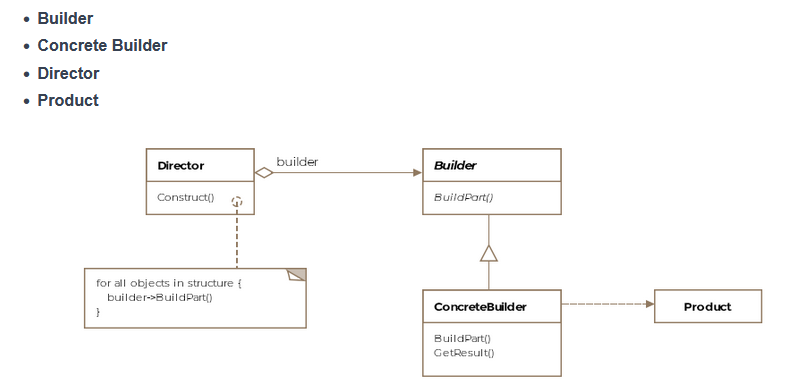

# Table of contents 
- [Table of contents](#table-of-contents)
- [Builder Pattern](#builder-pattern)
  - [What is it?](#what-is-it)
  - [Class Diagram](#class-diagram)
- [Builder Pattern Example in Python](#builder-pattern-example-in-python)
  - [Example](#example)
    - [House Class](#house-class)
    - [HouseBuilder Class](#housebuilder-class)
    - [Director Class](#director-class)
    - [Usage](#usage)
    - [Output](#output)
  - [Another Example: Building a Software Configuration](#another-example-building-a-software-configuration)
    - [SoftwareConfiguration Class](#softwareconfiguration-class)
    - [SoftwareConfigurationBuilder Class](#softwareconfigurationbuilder-class)
    - [Director Class](#director-class-1)
    - [Usage](#usage-1)
    - [Output](#output-1)
  - [Example: Implementing the Builder Pattern in Django Projects](#example-implementing-the-builder-pattern-in-django-projects)
    - [Models](#models)
    - [QuerySetBuilder Class](#querysetbuilder-class)
    - [Director Class](#director-class-2)
    - [Usage](#usage-2)

# Builder Pattern

## What is it? 
Formally, a builder pattern encapsulates or hides the process of building a complex object and separates the representation of the object and its construction. The separation allows us to construct different representations using the same construction process. 

## Class Diagram 


# Builder Pattern Example in Python

The Builder Pattern is a creational design pattern that allows you to construct complex objects step by step. It separates the construction of a complex object from its representation, allowing the same construction process to create different representations.

## Example

Let's create an example of a builder pattern to construct a `House` object.

### House Class

```python
class House:
    def __init__(self):
        self._walls = None
        self._roof = None
        self._windows = None
        self._doors = None

    def __str__(self):
        return f'House with {self._walls} walls, {self._roof} roof, {self._windows} windows, and {self._doors} doors.'

    def set_walls(self, walls):
        self._walls = walls

    def set_roof(self, roof):
        self._roof = roof

    def set_windows(self, windows):
        self._windows = windows

    def set_doors(self, doors):
        self._doors = doors
```

### HouseBuilder Class

```python
class HouseBuilder:
    def __init__(self):
        self.house = House()

    def build_walls(self, walls):
        self.house.set_walls(walls)
        return self

    def build_roof(self, roof):
        self.house.set_roof(roof)
        return self

    def build_windows(self, windows):
        self.house.set_windows(windows)
        return self

    def build_doors(self, doors):
        self.house.set_doors(doors)
        return self

    def get_house(self):
        return self.house
```

### Director Class

```python
class Director:
    def __init__(self, builder):
        self._builder = builder

    def construct_house(self):
        self._builder.build_walls("brick").build_roof("tile").build_windows(4).build_doors(2)
        return self._builder.get_house()
```

### Usage

```python
if __name__ == "__main__":
    builder = HouseBuilder()
    director = Director(builder)
    house = director.construct_house()
    print(house)
```

### Output

```
House with brick walls, tile roof, 4 windows, and 2 doors.
```

In this example, the `HouseBuilder` class provides methods to set different parts of the `House` object. The `Director` class uses the builder to construct a `House` object step by step.


## Another Example: Building a Software Configuration

This example will demonstrate how the builder pattern can be used in a software development project to create complex configurations with multiple options.

### SoftwareConfiguration Class

```python
class SoftwareConfiguration:
    def __init__(self):
        self._database = None
        self._cache = None
        self._message_queue = None
        self._logging = None

    def __str__(self):
        return f'SoftwareConfiguration with {self._database} database, {self._cache} cache, {self._message_queue} message queue, and {self._logging} logging.'

    def set_database(self, database):
        self._database = database

    def set_cache(self, cache):
        self._cache = cache

    def set_message_queue(self, message_queue):
        self._message_queue = message_queue

    def set_logging(self, logging):
        self._logging = logging
```

### SoftwareConfigurationBuilder Class

```python
class SoftwareConfigurationBuilder:
    def __init__(self):
        self.configuration = SoftwareConfiguration()

    def build_database(self, database):
        self.configuration.set_database(database)
        return self

    def build_cache(self, cache):
        self.configuration.set_cache(cache)
        return self

    def build_message_queue(self, message_queue):
        self.configuration.set_message_queue(message_queue)
        return self

    def build_logging(self, logging):
        self.configuration.set_logging(logging)
        return self

    def get_configuration(self):
        return self.configuration
```

### Director Class

```python
class Director:
    def __init__(self, builder):
        self._builder = builder

    def construct_full_configuration(self):
        self._builder.build_database("PostgreSQL").build_cache("Redis").build_message_queue("RabbitMQ").build_logging("ELK")
        return self._builder.get_configuration()

    def construct_minimal_configuration(self):
        self._builder.build_database("SQLite").build_logging("Console")
        return self._builder.get_configuration()
```

### Usage

```python
if __name__ == "__main__":
    builder = SoftwareConfigurationBuilder()
    director = Director(builder)

    full_config = director.construct_full_configuration()
    print(full_config)

    minimal_config = director.construct_minimal_configuration()
    print(minimal_config)
```

### Output

```
SoftwareConfiguration with PostgreSQL database, Redis cache, RabbitMQ message queue, and ELK logging.
SoftwareConfiguration with SQLite database, None cache, None message queue, and Console logging.
```

In this example, the `SoftwareConfigurationBuilder` class provides methods to set different parts of the `SoftwareConfiguration` object. The `Director` class uses the builder to construct different types of `SoftwareConfiguration` objects step by step. This demonstrates how the builder pattern can be used to create complex configurations with various options in a software development project.


## Example: Implementing the Builder Pattern in Django Projects

In Django projects, the builder pattern can be useful for constructing complex querysets or creating objects with many optional fields. Here is an example of how you might implement the builder pattern to create a complex queryset for a Django model.

### Models

```python
from django.db import models

class Product(models.Model):
    name = models.CharField(max_length=255)
    category = models.CharField(max_length=255)
    price = models.DecimalField(max_digits=10, decimal_places=2)
    in_stock = models.BooleanField(default=True)
```

### QuerySetBuilder Class

```python
class QuerySetBuilder:
    def __init__(self, model):
        self.queryset = model.objects.all()

    def filter_by_category(self, category):
        self.queryset = self.queryset.filter(category=category)
        return self

    def filter_by_price_range(self, min_price, max_price):
        self.queryset = self.queryset.filter(price__gte=min_price, price__lte=max_price)
        return self

    def filter_in_stock(self):
        self.queryset = self.queryset.filter(in_stock=True)
        return self

    def get_queryset(self):
        return self.queryset
```

### Director Class

```python
class ProductQueryDirector:
    def __init__(self, builder):
        self._builder = builder

    def construct_electronics_in_stock(self):
        return self._builder.filter_by_category("Electronics").filter_in_stock().get_queryset()

    def construct_affordable_products(self):
        return self._builder.filter_by_price_range(0, 100).get_queryset()
```

### Usage

```python
if __name__ == "__main__":
    builder = QuerySetBuilder(Product)
    director = ProductQueryDirector(builder)

    electronics_in_stock = director.construct_electronics_in_stock()
    print(electronics_in_stock)

    affordable_products = director.construct_affordable_products()
    print(affordable_products)
```

In this example, the `QuerySetBuilder` class provides methods to filter a Django queryset based on different criteria. The `ProductQueryDirector` class uses the builder to construct specific querysets step by step. This demonstrates how the builder pattern can be used to create complex querysets in a Django project.