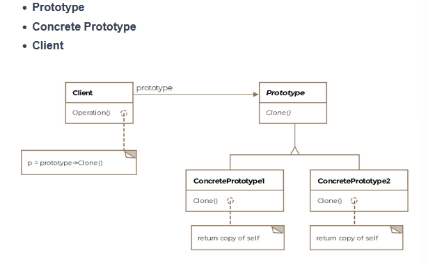

# Table of contents
- [Table of contents](#table-of-contents)
- [Prototype Pattern](#prototype-pattern)

# Prototype Pattern 
Formally, the pattern is defined as specify the kind of objects to create using a prototypical instance as a model and making copies of the prototype to create new objects.

Imagine a class will only be loaded at runtime and you can't access its constructor statically. The run-time environment creates an instance of each dynamically loaded class automatically and registers it with a prototype manager. The application can request objects from the prototype manager which in turn can return clones of the prototype.

# Class diagram 
