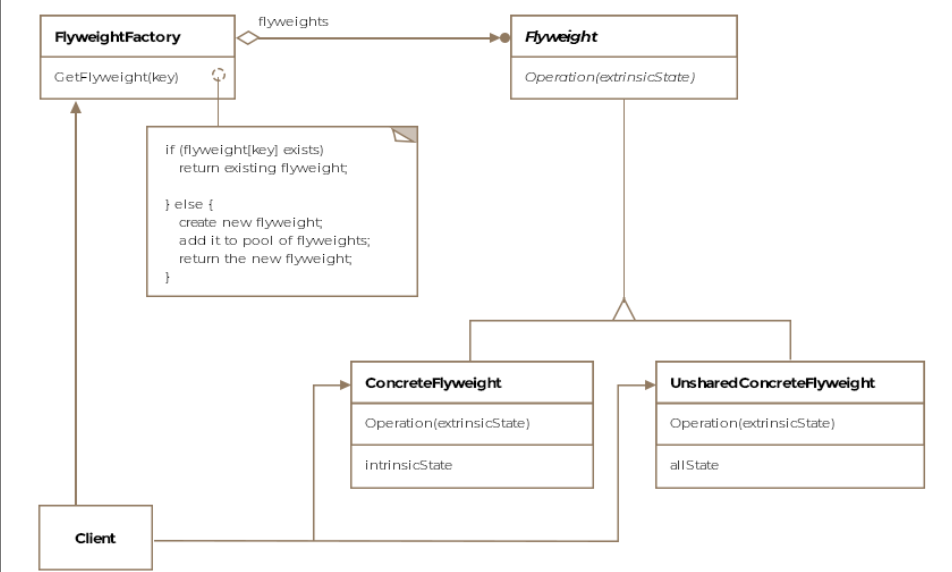

# Table of contents 
- [Table of contents](#table-of-contents)
- [Flyweight Pattern](#flyweight-pattern)
- [Class Diagram](#class-diagram)
- [Use Cases](#use-cases)
- [Example using Django](#example-using-django)
  - [Define the flyweight class](#define-the-flyweight-class)
  - [Define the flyweight factory](#define-the-flyweight-factory)
  - [Define the product class](#define-the-product-class)

# Flyweight Pattern 
It is a category in boxing competitions for light weight boxers. The intent of the pattern is somewhat similar in that it tries to reduce bloated code to a more compact and lean representation, which uses less memory. 

Formally, the pattern is defined as sharing state among a large number of fine-grained objects for efficiency. 


# Class Diagram


We have to have in mind some key concepts about this pattern, one is that flyweight is a shared object that contains the intrinsic state (common data), the instrinsic state is the state that is shared among multiple objects. Extrinsic State is the state that is unique to each object and is passed to the flyweight object when needed. Flyweight factory is a factory that creates and manages flyweight objects, ensuring that they are shared properly. 


# Use Cases 
1. Text editors. Representing characters in a document where each character is a flyweight object, and the font, size, and color are intrinsic states. 
2. Game development: Managing a large number of similar objects like trees, buildings, or characters in a game. 
3. Caching: Implementing caching mechanisms where shared data is reused to save 
4. Data Compression: Reducing memory usage by sharing common data among multiple objects. 


# Example using Django 

## Define the flyweight class
This class contains the instrinsic state(shared data)

```python 
# flyweight.py 


class CategoryFlyweight:
    def __init__(self, name):
        self.name = name 

    def __str__(self):
        return self.name
```

## Define the flyweight factory
This creates and manages flyweight objects

```python 
# flyweight_factory.py
from flyweight import CategoryFlyweight


class CategoryFlyweightFactory: 
    _categories = {}

    @classmethod
    def get_category(cls, name):
        if name not in cls._categories:
            cls._categories[name] = CategoryFlyweight(name)
        return cls._categories[name]
```


## Define the product class
This class uses the flyweight objects for categories

```python 
# models.py 
from django.db import models 
from .flyweight_factory import CategoryFlyweightFactory


class Product(models.Model):
    name = models.CharField(max_length=255)
    category_name = models.CharField(max_length=255)

    @property
    def category(self):
        return CategoryFlyweightFactory.get_factory(self.category_name)

    def __str__(self):
        return self.name
```