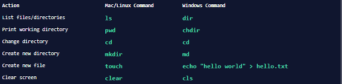
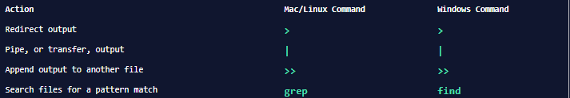
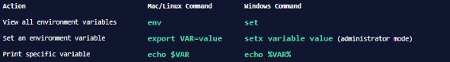

# Table of contents 
- [Table of contents](#table-of-contents)

# Command Line Basics 
## What Is The Command Line
The command line is a text interface for the computer's operating system. Through the command line you can create new files, edit the contents of those files, and more.

On mac and Linux the command line is called Bash. In windows we don't have Bash but we will download it.

## Git Bash
In order to work as a software developer we need to use Git Bash in Windows because is the equivalent to use bas on mac or Linux. 

1. Git Bash is a command line emulation program for windows
2. This gives you access to all of the git features in the command line plus most standard Unix commands. 
3. Microsoft has released a Linux subsystem for windows 10 but it still has some severe limitations and bugs. 

## Bash to Windows Command Prompt Translation Guide
### Navigation

### Manipulation

### Redirection

### Environment
